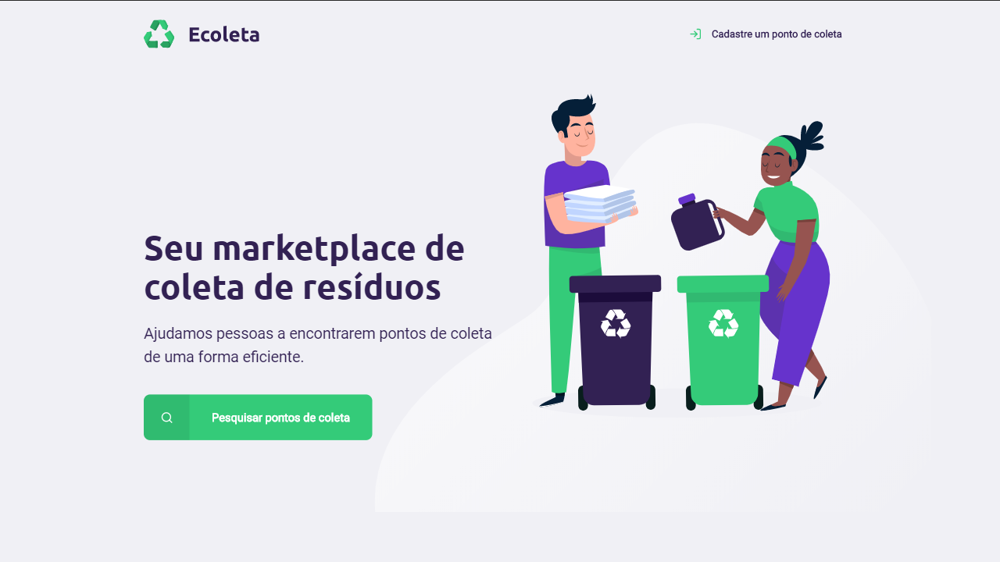
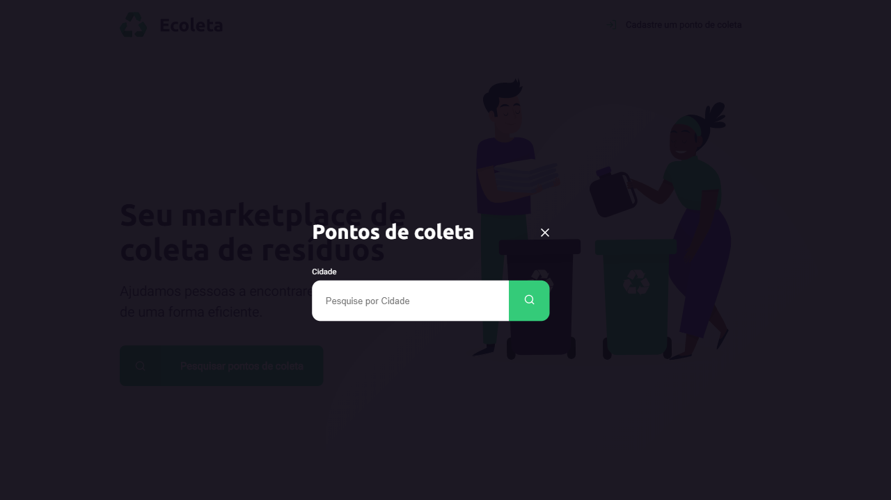
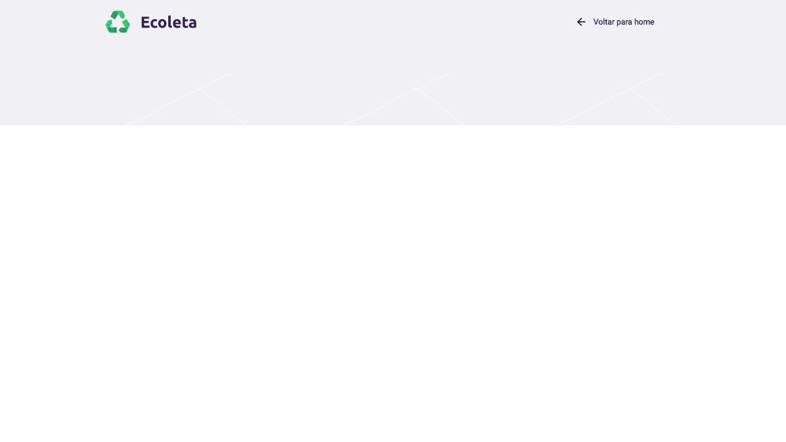
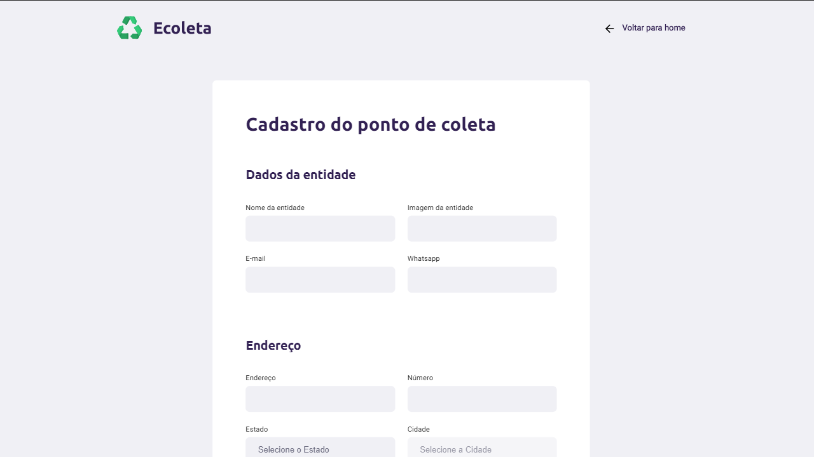
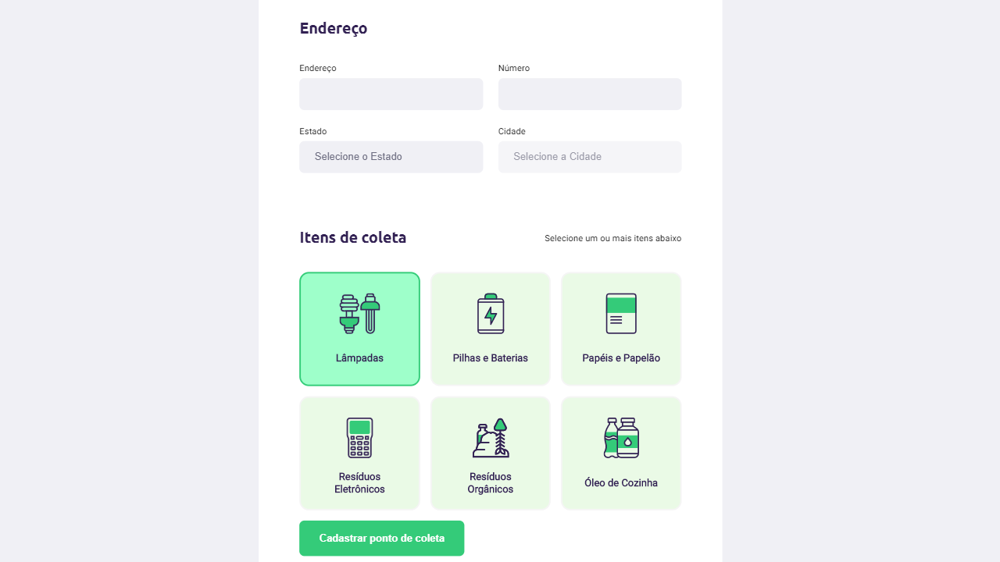
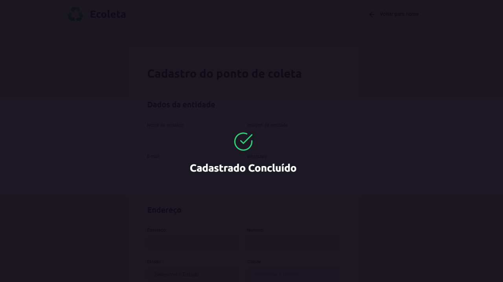

Projeto com a finalidade de ajudar pessoas com resíduos "especiais" a encontrar locais para recebe-los.

Desenvolvido durante a NLW da [Rocketseat](https://rocketseat.com.br/).

## Backend
- A pasta de dados por padrão é a pasta data na raiz do projeto, mas pode ser alterada usando a variável de ambiente DATA_FOLDER

- HTTP_PORT = porta onde o servidor vai escutar

- Knex usa sqlite3. 

- O multer só vai aceitar receber png ou jpeg, isso é por que o react native não suporta SVG out of the box.

- Os nomes das imagens são gerados usando o sha1.extensão.

## Tecnologias usadas:
- Typescript, typescript everywhere

- O css não fui eu que fiz, ele foi fornecido pelo Diego da Rocketseat.

- Nenhuma classe foi criada, nem mesmo a controller.

## 💻 Template

